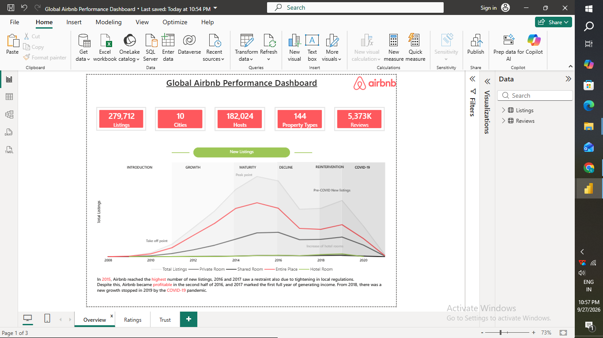
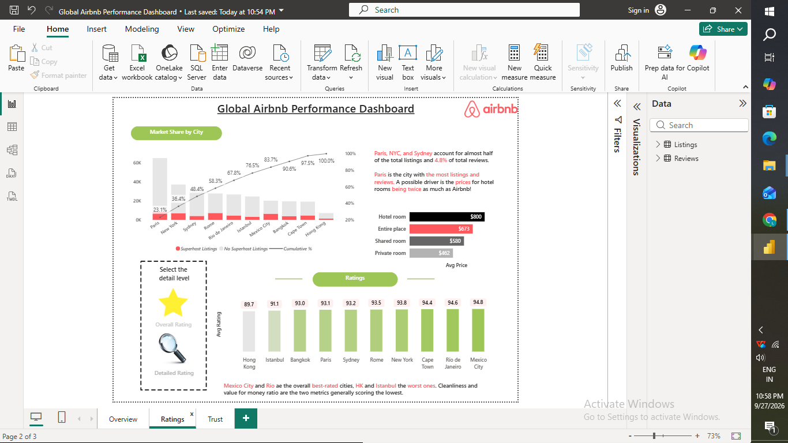
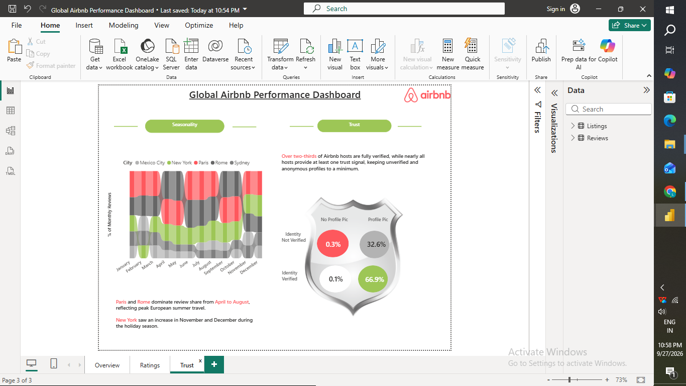

# Global Airbnb Performance Dashboard (Power BI)

A 3-page Power BI dashboard analyzing Airbnb's global listings, host trust, and guest ratings across 10 major cities (279,712 listings, 182,024 hosts, 5,373K reviews).

## Pages

**Overview** — KPI cards (Listings, Cities, Hosts, Property Types, Reviews) plus a listings-growth timeline (2008–2020) annotated by market phase: Introduction, Growth, Maturity, Decline, Reintervention, and COVID-19

**Ratings** — Market share by city (Pareto chart), average price by room type, and average rating by city, with call-outs on top/bottom rated cities and pricing drivers. A star icon and magnifier icon act as bookmark buttons, letting you switch between an "Overall Rating" view and a "Detailed Rating" (Accuracy, Cleanliness, Communication, Location, Value) view

**Trust** — Seasonality of reviews by city (Apr–Aug peak for Paris/Rome, Nov–Dec peak for NYC) and a host-verification breakdown (profile photo vs. identity verification)

## Skills Practiced
- Showing key numbers (KPIs) as simple cards at the top of a report
- Adding text call-outs to explain what a chart is showing
- Building a timeline chart to show growth over many years
- Making a chart that shows which cities make up most of the market
- Showing trends by month to spot seasonal patterns
- Building a visual to show how many hosts are verified/trusted
- Using bookmarks + buttons (icons) to let users switch between two different views of the same page
- Connecting and modeling two related tables (Listings and Reviews)

## Credits
Built by following a YouTube tutorial to learn Power BI dashboard design and DAX.

## Dataset
Dataset sourced from [Maven Analytics – Airbnb Listings & Reviews](https://mavenanalytics.io/data-playground/airbnb-listings-reviews).

## File
`Global_Airbnb_Performance_Dashboard.pbix` — open in Power BI Desktop